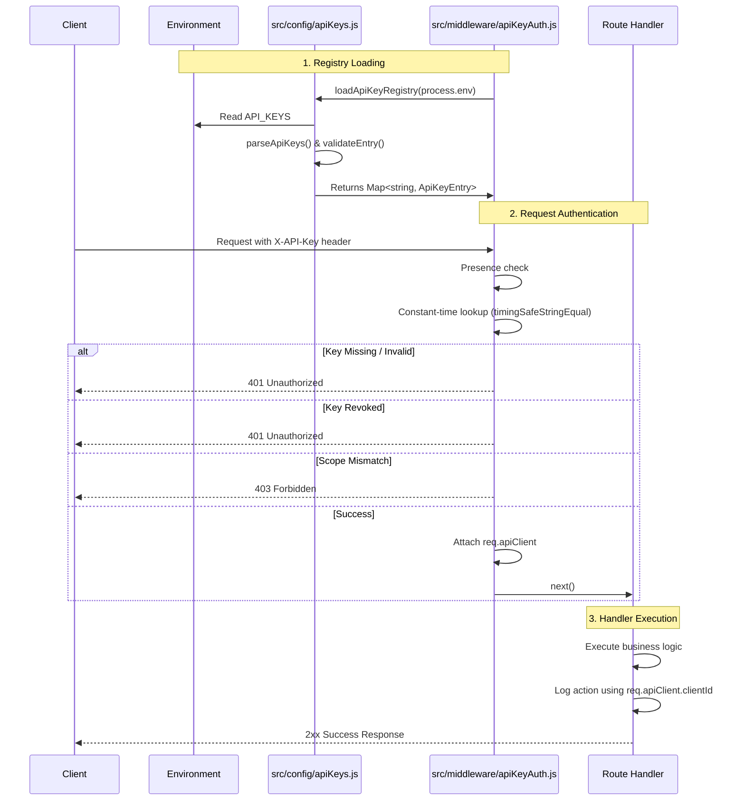

# API Keys Request Lifecycle

This document provides an end-to-end overview of the API key authentication lifecycle in the LiquiFact backend. 

Historically, API keys were backed by a SQLite database. This approach has been retired (Issue #590) in favor of an environment-backed, in-memory registry. This ensures zero database overhead per request and allows for zero-downtime key rotation.

## Architecture Diagram



## 1. Validation and Persistence (Environment-Backed)

**File:** `src/config/apiKeys.js`

API keys are no longer persisted in a per-request database. Instead, the system uses an environment-backed registry to load keys at runtime.
- **Source**: Keys are loaded from the `API_KEYS` environment variable.
- **Format**: A semicolon-separated list of JSON objects (e.g., `{"key":"lf_abc123","clientId":"service-a","scopes":["invoices:read"]}`).
- **Validation**: `validateEntry()` strictly enforces that keys start with the `lf_` prefix, meet the `MIN_KEY_LENGTH` (10 chars), contain a non-empty `clientId`, and only grant recognized `VALID_SCOPES`.
- **Registry**: The keys are parsed and stored in an `O(1)` Map via `buildKeyRegistry()`. Duplicate keys trigger a fatal error at startup.

## 2. Authentication Middleware

**File:** `src/middleware/apiKeyAuth.js`

The `authenticateApiKey({ requiredScope })` middleware intercepts incoming requests and performs the following checks:

1. **Presence Check**: Ensures the `X-API-Key` header exists.
2. **Registry Lookup**: Reloads the registry and uses `timingSafeStringEqual` to compare the incoming key against registered keys in constant time. This prevents timing-based enumeration attacks.
3. **Revocation Check**: Rejects keys marked with `"revoked": true` with a `401 Unauthorized`.
4. **Scope Check**: If the route requires a specific scope (e.g., `invoices:write`), the middleware verifies the key possesses it. Otherwise, it returns `403 Forbidden`.

If all checks pass, the middleware strips the sensitive key material and attaches a safe object to the request:
```javascript
req.apiClient = {
  clientId: entry.clientId,
  scopes: [...entry.scopes],
};
```

## 3. Handler Execution

**File Example:** `src/routes/adminWebhooks.js`

Once the middleware calls `next()`, the route handler takes over. The handler accesses `req.apiClient` to make authorization decisions or populate audit logs, without ever exposing the raw key string.

For example, when an admin triggers a dead-letter replay:
```javascript
logger.info(
  { deadLetterId: id, adminClient: req.apiClient?.clientId || req.user?.sub }, 
  'Admin triggered replay'
);
```

### Key Rotation (Zero-Downtime)
Because keys are stateless and environment-backed, rotation is seamless:
1. Append the new key entry to `API_KEYS` and deploy (both old and new keys work).
2. Update callers to use the new key.
3. Update the old entry with `"revoked": true` and redeploy. The old key is immediately rejected with a `401`, while the new key continues to work.
