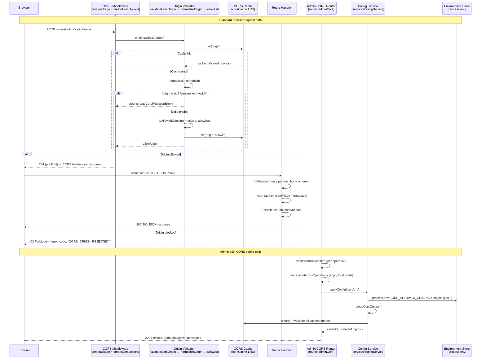

# CORS Request Lifecycle

End-to-end walkthrough of how a Cross-Origin Resource Sharing request flows through the LiquiFact backend — from the browser's `Origin` header to the final response — covering validation, authentication/authorisation, handler execution, and persistence of configuration changes.

---

## Diagram



---

## 1. Request arrives — CORS middleware intercepts first

The CORS middleware is the **first** middleware registered in the Express app
([`src/app.js:147`](../src/app.js)). It runs before body parsers, auth middleware,
and every route handler:

```js
app.use(cors(createCorsOptions()));
```

The `cors` npm package invokes the `origin` callback for every inbound request.
`createCorsOptions()` (defined in [`src/config/cors.js:461`](../src/config/cors.js))
returns an options object whose `origin` callback delegates to
`validateCorsOrigin()`.

---

## 2. Validation — origin negotiation

### 2.1 The `origin` callback

```
origin(origin, callback)
```

Defined at [`src/config/cors.js:488`](../src/config/cors.js). It receives the raw
`Origin` header value from the browser (or `undefined` when the header is absent).

**Decision rules:**

| `origin` value | Outcome | Reason |
|---|---|---|
| `undefined` (no header) | Allow | Non-browser client (curl, Postman, server-to-server). No CORS headers added. |
| `"null"` | **Deny** | Sandboxed iframe / data-URI navigation. `normalizeOrigin` returns `null` immediately. |
| Valid URL, in allowlist | Allow | `Access-Control-Allow-Origin` is set to the exact incoming origin. |
| Valid URL, not in allowlist | **Deny** | `handleCorsError` converts the rejection error into a 403 JSON response. |
| Non-URL string | **Deny** | Fails `new URL()` parsing in `normalizeOrigin`; treated as unrecognised. |

### 2.2 Normalization (`normalizeOrigin`)

Before any allowlist comparison, both the incoming origin and each allowlist
entry are normalised through the WHATWG `URL` parser
([`src/config/cors.js:219`](../src/config/cors.js)):

1. Parse the string with `new URL(origin)`.
2. Extract `url.origin` — this lowercases scheme and host and strips the
   trailing slash.
3. Return `null` for the literal `"null"`, empty strings, and non-URL inputs.

```
normalizeOrigin("HTTPS://APP.EXAMPLE.COM/")
  → new URL("HTTPS://APP.EXAMPLE.COM/")
  → url.origin = "https://app.example.com"
```

### 2.3 Allowlist lookup (`validateCorsOrigin`)

Defined at [`src/config/cors.js:418`](../src/config/cors.js):

```js
function validateCorsOrigin(origin, allowlist) {
  if (origin === undefined) return true;        // no-header pass-through
  const cached = cache.get(origin);             // check LRU cache first
  if (cached !== undefined) return cached;
  const allowed = allowlist.length > 0
    && isAllowedOrigin(origin, allowlist);      // normalise + exact match
  cache.set(origin, allowed);                   // store result
  return allowed;
}
```

The allowlist itself is built by `getAllowedOriginsFromEnv()`
([`src/config/cors.js:181`](../src/config/cors.js)), which reads
`CORS_ALLOWED_ORIGINS` (preferred) or `CORS_ORIGINS` from the environment
and applies the development fallback when `NODE_ENV=development`.

---

## 3. CORS cache — performance optimisation

The LRU cache lives in [`src/config/corsCache.js`](../src/config/corsCache.js).
Hot CORS read paths call `validateCorsOrigin` on every inbound request; the
cache stores the boolean outcome keyed by the raw origin string to avoid
repeated normalisation and allowlist scans.

| Setting | Default | Env variable |
|---|---|---|
| TTL | 5 seconds | `CORS_CACHE_TTL_SECONDS` |
| Max entries | 256 | `CORS_CACHE_MAX_ENTRIES` |

The cache is **fully invalidated** when the allowlist changes
(`reloadCorsOrigins()` calls `getCorsCache().clear()`).

---

## 4. Auth — CORS as the origin gatekeeper

CORS is not authentication in the JWT sense, but it **is** the authorisation
gate for browser-origin requests. The `origin` callback's decision is the
first security boundary:

- **Allowed origin**: the request proceeds to body parsers, security headers,
  request ID, correlation ID, and then the route handler chain.
- **Blocked origin**: the `cors` package calls `callback(err)` with the
  rejection error. `handleCorsError` in `app.js`
  ([`src/app.js:83`](../src/app.js)) intercepts it and returns a 403:

```json
{ "error": "CORS policy: origin is not allowed.", "code": "CORS_ORIGIN_REJECTED" }
```

After CORS passes, route handlers may apply additional auth layers (e.g.
`authenticateToken` via `adminStack` or `authenticatedTenantStack` defined in
[`src/middleware/stacks.js`](../src/middleware/stacks.js)).

---

## 5. Handler execution

Once CORS and any subsequent auth middleware have passed the request, it
reaches the route handler. For example, `GET /api/invoices` (defined inline
in [`src/app.js:256`](../src/app.js)) runs query-parameter validation
(`validateInvoiceQueryParams`) before calling `invoiceService.getInvoicesWithPagination`.

For protected routes mounted via feature routers, the handler chain typically
includes:

1. **Body-size guardrails** (`jsonBodyLimit`, `urlencodedBodyLimit`)
2. **Security headers** (`createSecurityMiddleware`)
3. **Auth** (`authenticateToken` via `authenticatedTenantStack`)
4. **Tenant extraction** (`extractTenant` — sets `req.tenantId`)
5. **Route-specific validation** (Zod schemas, custom validators)
6. **Persistence** (database insert/update via `knex` or event projection)
7. **Response** (JSON envelope via `toStandardEnvelope` when using
   `createStandardizedApp()`)

---

## 6. Persistence — CORS configuration changes

The admin endpoint `POST /api/admin/cors/bulk`
([`src/routes/adminCors.js`](../src/routes/adminCors.js)) allows runtime
mutation of the CORS allowlist. The persistence path is:

### 6.1 Structural validation

The route validates the request body before processing any operations:

| Check | Error code | HTTP status |
|---|---|---|
| `operations` is not an array | `VALIDATION_ERROR` | 400 |
| `operations` is empty | `VALIDATION_ERROR` | 400 |
| `operations` exceeds 25 items | `BATCH_TOO_LARGE` | 400 |

### 6.2 Per-operation validation (`validateBulkCorsItem`)

Each item in the `operations` array is validated independently
([`src/config/cors.js:573`](../src/config/cors.js)). Rules:

- `op` must be `add`, `remove`, or `replace`.
- `origin` must be a valid, parseable origin URL (passes `validateOriginEntry`).
- `newOrigin` is required and must be valid when `op` is `replace`.
- `newOrigin` must not be provided for `add` or `remove`.

### 6.3 Batch processing (`processBulkCorsOperations`)

Defined at [`src/config/cors.js:646`](../src/config/cors.js). Operations are
applied sequentially to a mutable copy of the current allowlist:

- **add** — appends the origin if not already present.
- **remove** — removes the origin if present; no-op with success if absent.
- **replace** — swaps an existing origin for a new one; fails if the old origin
  is not in the allowlist.

After all operations are processed, the updated allowlist replaces the module-level
`allowedOrigins` array, making the change visible to new requests immediately.

### 6.4 Config service persistence (admin-config API path)

When CORS configuration is applied through the admin config endpoint
(`POST /api/admin/config`), the path goes through
[`src/services/configService.js`](../src/services/configService.js):

1. `applyConfig('cors', config, context)` is called.
2. `applyCorsConfig(config)` updates `process.env.CORS_ALLOWED_ORIGINS` and/or
   `process.env.CORS_MAX_AGE`.
3. `reloadCorsOrigins()` re-reads the environment, re-parses the allowlist, and
   replaces the module-level mutable array in `src/config/cors.js`.
4. `reloadCorsMaxAge()` re-reads `CORS_MAX_AGE` and updates the module-level
   `maxAge` variable.
5. `reloadCorsOrigins()` also calls `getCorsCache().clear()` to invalidate the
   LRU cache so that cached rejection/allow results for previous origins are
   not served stale.

This is a **runtime, memory-only** persistence model — the allowlist lives in
`process.env` and the in-memory `allowedOrigins` variable. There is no database
write for CORS configuration. Server restart causes the allowlist to be
re-read from the environment.

---

## 7. Error handling

CORS produces exactly one error type. There are no partial or degraded responses
at the CORS boundary.

| Field | Value |
|---|---|
| HTTP status | `403 Forbidden` |
| `error` | `"CORS policy: origin is not allowed."` |
| `code` | `"CORS_ORIGIN_REJECTED"` |

The error is produced by `createCorsRejectionError()`
([`src/config/cors.js:261`](../src/config/cors.js)) and detected by
`isCorsOriginRejectedError()` ([`src/config/cors.js:277`](../src/config/cors.js)).
The handler `handleCorsError` in `app.js`
([`src/app.js:83`](../src/app.js)) converts it to the JSON response; all other
errors pass through to the next error handler.

---

## 8. Preflight (OPTIONS) flow

Preflight requests follow the same CORS validation path but are handled
entirely by the `cors` npm package. When the browser sends an `OPTIONS` request
with `Access-Control-Request-Method` and `Access-Control-Request-Headers`, the
CORS middleware:

1. Validates the `Origin` header against the allowlist (same path as above).
2. If allowed, responds with `204 No Content` and the standard CORS response
   headers (`Access-Control-Allow-Origin`, `Access-Control-Allow-Methods`,
   `Access-Control-Allow-Headers`, `Access-Control-Allow-Credentials`,
   `Access-Control-Max-Age`).
3. If blocked, returns `403 Forbidden` with the standard JSON error body.

The `optionsSuccessStatus` is set to `204` ([`src/config/cors.js:496`](../src/config/cors.js)).
Preflight responses are cached by the browser for `Access-Control-Max-Age` seconds
(default 600, max 86400).

---

## 9. Key cross-references

| Concept | File | Line(s) |
|---|---|---|
| `createCorsOptions()` | `src/config/cors.js` | 461–528 |
| `validateCorsOrigin()` | `src/config/cors.js` | 418–429 |
| `normalizeOrigin()` | `src/config/cors.js` | 219–234 |
| `isAllowedOrigin()` | `src/config/cors.js` | 247–251 |
| `createCorsRejectionError()` | `src/config/cors.js` | 261–268 |
| `isCorsOriginRejectedError()` | `src/config/cors.js` | 277–279 |
| CORS LRU cache | `src/config/corsCache.js` | 92–159 |
| CORS middleware registration | `src/app.js` | 147 |
| `handleCorsError` middleware | `src/app.js` | 83–89 |
| Admin bulk CORS route | `src/routes/adminCors.js` | 156–214 |
| `processBulkCorsOperations` | `src/config/cors.js` | 646–724 |
| `validateBulkCorsItem` | `src/config/cors.js` | 573–623 |
| Config service CORS apply | `src/services/configService.js` | 69–79 |
| `reloadCorsOrigins` | `src/config/cors.js` | 392–396 |
| Allowlist persistence model | `src/config/cors.js` | 376–377 (module-level `allowedOrigins`) |
| Preflight max-age | `src/config/cors.js` | 358–527 |
| CORS API contract reference | `docs/cors.md` | — |
| Request lifecycle middleware order | `docs/request-lifecycle-middleware-order.md` | — |
| CORS operations runbook | `docs/runbook-cors.md` | — |

---

## See also

- [`docs/cors.md`](./cors.md) — CORS API contract and request/response examples
- [`docs/runbook-cors.md`](./runbook-cors.md) — operations runbook for CORS incidents
- [`docs/request-lifecycle-middleware-order.md`](./request-lifecycle-middleware-order.md) — middleware ordering across the full stack
- [`src/config/cors.js`](../src/config/cors.js) — implementation source
- [`src/config/corsCache.js`](../src/config/corsCache.js) — LRU cache implementation
- [`src/routes/adminCors.js`](../src/routes/adminCors.js) — admin bulk CORS endpoint
- [`tests/cors.bulk.test.js`](../tests/cors.bulk.test.js) — integration tests for bulk CORS operations
- [`src/config/cors.test.js`](../src/config/cors.test.js) — unit tests for CORS configuration
- [`src/cors.endpoint.test.js`](../src/cors.endpoint.test.js) — endpoint-level CORS tests