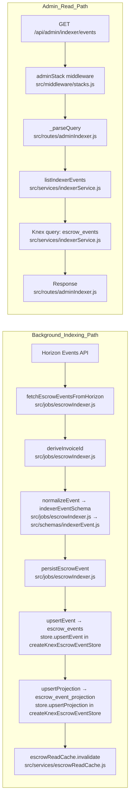

# Indexer Request Lifecycle

> **Scope:** `Liquifact/Liquifact-backend`
> **Last updated:** 2026-07-25
> **Cross-reference:** `src/jobs/escrowIndexer.js` · `src/routes/adminIndexer.js` · `src/services/indexerService.js` · `src/schemas/indexerEvent.js` · `src/middleware/stacks.js` · `src/utils/cursorPagination.js`

## Overview

The indexer subsystem has two distinct paths. The **background indexing path** polls the Stellar Horizon events API, validates incoming contract events against a Zod schema, resolves each event to a business `invoiceId`, and persists raw events and per-invoice projections to PostgreSQL. The **admin read path** serves a cursor-paginated HTTP endpoint (`GET /api/admin/indexer/events`) so operators can inspect the raw event log without querying the database directly.

This document traces both paths end-to-end, from entry point through every layer to persistence (or response), with real file and function references at each stage.

---

## Flow diagram

---

## Background indexing path

This path runs in a polling loop. The `createEscrowIndexer()` factory (`src/jobs/escrowIndexer.js:425`) returns `{ start, stop, runCycle }`. Calling `start()` runs an immediate cycle then sets a `setInterval` timer (default `ESCROW_INDEXER_POLL_INTERVAL_MS = 15_000`). The indexer is **not** started by the main server — the module exports the factory and its primitives so deployment tooling can decide when and how to run it (e.g. as a separate process).

### Stage 1 — Fetch events from Horizon

**File:** `src/jobs/escrowIndexer.js:327` — `fetchEscrowEventsFromHorizon()`

Built from `STELLAR_HORIZON_URL` (default `https://horizon-testnet.stellar.org`). Constructs a `GET /events` URL with `order=asc`, `limit` (default 100), and optional `cursor`. Parses the HAL response (`_embedded.records`).

For each record, calls `deriveInvoiceId(record)` (`src/jobs/escrowIndexer.js:89`). The derivation priority is:

1. An explicit `invoice_id` / `invoiceId` field on the record.
2. The event `value` body (`body.invoice_id` / `body.invoiceId`).
3. An explicit `invoice_id` / `invoiceId` field in one of the topic entries.
4. Reverse lookup via `resolveInvoiceByAddress` (`src/config/escrowMap`) on `record.contract_id`.

Any record that does not yield a valid `invoiceId` (matching `/^[a-zA-Z0-9_-]{1,128}$/`) is **filtered out** and not included in the returned `events` array. The next cursor is derived from the last record's `paging_token`.

**Error path:** A non-`2xx` Horizon response throws an error. The cycle's `try/catch` in `runEscrowIndexerCycle` increments `escrowIndexerCycleFailuresTotal` and logs the error. The cursor is **not** advanced.

### Stage 2 — Normalize and validate

**File:** `src/jobs/escrowIndexer.js:162` — `normalizeEvent()`

Calls `indexerEventSchema.safeParse(rawEvent)` (`src/schemas/indexerEvent.js:15`). This Zod schema enforces:

| Field | Type | Constraint |
|-------|------|------------|
| `eventId` | string | 1–256 chars, trimmed |
| `invoiceId` | string | `/^[a-zA-Z0-9_-]{1,128}$/`, trimmed |
| `eventType` | string | 1–128 chars, trimmed |
| `ledgerSequence` | number | Positive integer, ≤ `Number.MAX_SAFE_INTEGER` |
| `pagingToken` | string | Max 2048 chars, defaults to `''` |
| `contractId` | string \| null | Optional; must match `/^C[A-Z2-7]{55}$/` if present |
| `txHash` | string \| null | Optional; must match `/^[0-9a-fA-F]{64}$/` if present |
| `eventBody` | unknown | Optional, no validation |
| `observedAt` | string | Optional; must be valid ISO 8601 datetime if present |

The schema uses `.strict()` so unknown fields cause a validation failure.

**Error path:** On validation failure, `normalizeEvent` throws a `ValidationError` with code `VALIDATION_ERROR` and field-level detail. The cycle's `for` loop catches it, increments the `skipped` counter, logs a warning, and continues to the next event.

### Stage 3 — Persist event and update projection

**File:** `src/jobs/escrowIndexer.js:299` — `persistEscrowEvent()`

Runs inside a Knex **transaction**:

1. **`store.upsertEvent(trx, event)`** (`src/jobs/escrowIndexer.js:222`): Inserts into `escrow_events` with `.onConflict('event_id').ignore()`. This makes duplicate `event_id` values idempotent — the first write wins, subsequent ones are silently ignored.

2. **`store.findProjection(event.invoiceId)`** (`src/jobs/escrowIndexer.js:218`): Reads the current per-invoice projection row from `escrow_event_projection`.

3. **`shouldReplaceProjection(current, event)`** (`src/jobs/escrowIndexer.js:272`): Compares ledger sequence (higher wins), then paging token as tiebreaker.

4. **`store.upsertProjection(trx, event)`** (`src/jobs/escrowIndexer.js:239`): If the projection should be replaced, upserts into `escrow_event_projection` on `invoice_id` via `.onConflict('invoice_id').merge()`.

5. **`escrowReadCache.invalidate(event.invoiceId)`** (`src/jobs/escrowIndexer.js:312`): Busts the process-local `escrowReadCache` so subsequent `GET /api/escrow/:invoiceId` calls re-read from the projection table.

**Error path:** If the transaction throws, no events from that transaction are persisted, and the error propagates to the cycle's `for` loop, where it is caught, logged, and skipped.

### Stage 4 — Advance cursor

**File:** `src/jobs/escrowIndexer.js:411` — `runEscrowIndexerCycle()`

After all events in the batch are processed, if `nextCursor` differs from the previous cursor, calls `store.saveCursor(nextCursor)` (`src/jobs/escrowIndexer.js:211`) which upserts into `escrow_indexer_state` where `key = 'horizon_cursor'`.

The cursor is **not** advanced if:
- The batch was empty (no records returned).
- An HTTP or network error occurred before events could be parsed.

### Stage 5 — Emit metrics

**File:** `src/jobs/escrowIndexer.js:461` — inside `createEscrowIndexer`'s `runCycle`

After the cycle completes, four Prometheus metrics are updated:

| Metric | Type | Condition |
|--------|------|-----------|
| `escrow_indexer_events_processed_total` | Counter | Incremented by `processed` count |
| `escrow_indexer_events_skipped_total` | Counter | Incremented by `skipped` count |
| `escrow_indexer_cycle_failures_total` | Counter | Incremented when `processed` or `skipped` is invalid, or when an unhandled exception occurs |
| `escrow_indexer_last_cursor_advance_timestamp_seconds` | Gauge | Set to `Date.now() / 1000` when cursor advances |

Each count is validated (must be a non-negative integer) before being passed to `.inc()`.

---

## Admin read path

### Stage 1 — Express global middleware

**File:** `src/app.js`

Before reaching the indexer router, every request passes through these middleware layers (in order):

1. CORS (`createCorsOptions`)
2. JSON body limit (100 KB) and URL-encoded body limit (50 KB)
3. Security headers (`createSecurityMiddleware`)
4. Audit middleware (`auditMiddleware`)
5. Request ID (`requestId`)
6. Correlation ID (`correlationIdMiddleware`)

### Stage 2 — Auth and tenant extraction

**File:** `src/middleware/stacks.js:63` — `adminStack`

Applied to every route in the admin indexer router via `router.use(...adminStack)` (`src/routes/adminIndexer.js:33`).

The stack executes:

1. **`adminAuth`** (`src/middleware/stacks.js:32`):
   - If the `x-api-key` header is present: delegates to `authenticateApiKey()` (`src/middleware/apiKeyAuth.js:91`). The middleware factory is called with **no** `requiredScope` — any valid, non-revoked key is accepted. After successful auth, `req.apiClient` is set.
   - Otherwise: delegates to `authenticateToken` (`src/middleware/auth.js:57`). Validates `Authorization: Bearer <JWT>` with algorithm allowlist (default `HS256`), optional issuer/audience checks, and attaches `req.user`.

2. **`extractTenant`** (`src/middleware/tenant.js:54`):
   - Resolves `req.tenantId` from `x-tenant-id` header (highest priority) or `req.user.tenantId` (JWT claim).

**Error paths:**
- JWT missing/invalid/expired: `authenticateToken` calls `next(new AppError(...))` which is caught by the `handleInternalError` handler in `src/app.js:96`, returning 401.
- API key missing/invalid/revoked: `authenticateApiKey` responds directly with a 401 JSON body (bypasses the centralized error handler).
- Tenant cannot be resolved (`extractTenant`): responds with 400 and a JSON body `{ error: 'Missing tenant context.' }`.

### Stage 3 — Query parameter validation

**File:** `src/routes/adminIndexer.js:41` — `_parseQuery()`

A pure function that validates and normalises query parameters. Rejects unknown parameters with a `400` and a `_unknown` detail key.

Allowed parameters and their constraints:

| Parameter | Validation | Error detail key |
|-----------|-----------|------------------|
| `invoiceId` | `/^[a-zA-Z0-9_-]{1,128}$/` | `invoiceId` |
| `eventType` | Non-empty string, ≤ 128 chars | `eventType` |
| `contractId` | `/^C[A-Z2-7]{55}$/` (Stellar contract address) | `contractId` |
| `sortBy` | One of `observed_at`, `ledger_sequence` | `sortBy` |
| `order` | `asc` or `desc` (case-insensitive) | `order` |
| `cursor` | Non-empty string, ≤ 2048 chars | `cursor` |
| `page` | Integer ≥ 1 (ignored when `cursor` is present) | `page` |
| `limit` | Integer 1–100 | `limit` |

Returns `{ isValid, fieldErrors, params }`. If `isValid` is `false`, the route responds immediately with `400` and the field-level errors.

### Stage 4 — Service layer (listing)

**File:** `src/services/indexerService.js:150` — `listIndexerEvents()`

Receives the validated `params` object with `filters`, `sorting`, and `pagination` sub-objects.

**Filtering** (`_applyFilters`, line 103): Applies exact-match Knex `.where()` clauses for `invoiceId`, `eventType`, and `contractId` to both the count query and the data query.

**Pagination modes:**

1. **Cursor (keyset) mode** (when `pagination.cursor` is provided):
   - Calls `decodeCursor(cursor, sortField)` (`src/utils/cursorPagination.js:88`). This decodes the base64url payload, verifies the HMAC-SHA256 signature using `CURSOR_SECRET` or `JWT_SECRET` (with a dev fallback), validates the sort field matches the request's `sortBy`, and optionally checks cursor TTL (`CURSOR_TTL_ENABLED`).
   - Applies a keyset predicate: `WHERE (sortField > lastValue) OR (sortField = lastValue AND event_id > lastId)` (or `<` for `DESC`).
   - Fetches `limit + 1` rows to determine `hasMore` without a second count query.
   - Encodes a `nextCursor` for the last row in the returned page via `encodeCursor`.

2. **Offset mode** (legacy, when `page`/`limit` are provided without cursor):
   - Standard `LIMIT/OFFSET` pagination.
   - Still returns `nextCursor` so callers can migrate to cursor mode.

**Error paths:**
- Malformed/tampered cursor: `decodeCursor` throws `CursorError`. The route handler (`src/routes/adminIndexer.js:274`) catches it and returns `400` with a `VALIDATION_ERROR` code and the cursor error message in `details.cursor`.
- Database error: Propagates as an unhandled exception caught by the route's outer `catch`, which calls `next(error)` and ultimately hits `handleInternalError` in `src/app.js`, returning 500.

### Stage 5 — Response

**File:** `src/routes/adminIndexer.js:300`

On success: returns `200` with the response envelope from `responseHelper.success()`. The `meta` object includes `total`, `limit`, `hasMore`, and `nextCursor`. In offset mode, `page` and `totalPages` are also included. A structured log line is emitted with request ID, count, total, and cursor usage.

The `event_body` column is **excluded** from the list response to keep payloads small (controlled by `SELECT_COLUMNS` in `src/services/indexerService.js:79`).

---

## Edge cases and gotchas

### Idempotency (background path)

Duplicate events with the same `eventId` are silently ignored by the `ON CONFLICT DO NOTHING` upsert. The projection upsert uses `ON CONFLICT DO UPDATE` (merge), so a duplicate event with a newer ledger sequence will replace the projection. This means the projection always reflects the most recent event for a given invoice.

### Cursor security (admin read path)

Cursors are opaque, base64url-encoded, and HMAC-SHA256-signed. The secret is resolved from `CURSOR_SECRET` or `JWT_SECRET`. In development/test, a weak literal fallback (`dev-cursor-secret-change-in-prod`) is used. Any tampering is detected by the `decodeCursor` function and returns `400`. Cursor TTL is optional (`CURSOR_TTL_ENABLED`).

### Tenant isolation (admin read path)

`extractTenant` runs as part of `adminStack`, but the service layer (`listIndexerEvents`) does **not** filter `escrow_events` by `req.tenantId`. The `escrow_events` table is treated as admin-level data with no tenant partition. This is a deliberate design choice documented in the route file.

### Invoice ID derivation (background path)

The derivation priority in `deriveInvoiceId` explicitly avoids treating bare topic symbols (like the event-name symbol `escrow_funded`) as invoice IDs. Only explicitly-labelled `invoice_id` / `invoiceId` fields in topics are trusted. The fallback reverse lookup via `resolveInvoiceByAddress` returns `null` if the contract address maps to itself (i.e. the mapping is for a contract, not an invoice), preventing mis-keying.

### No tenant filtering on escrow_events

The `listIndexerEvents` service performs no tenant-scoped filtering despite `extractTenant` running. All admin users see all events regardless of tenant context.

### Skipped events do not stall ingestion

When an event fails validation in the background path, the cycle logs a warning, increments the skipped counter, and continues processing the remaining events. The cursor is advanced past the entire batch (based on the last record's `paging_token`), so skipped events are not re-fetched on the next cycle.

### Re-entrancy guard

The `createEscrowIndexer`'s `runCycle` uses a `running` flag (`src/jobs/escrowIndexer.js:444`) to prevent concurrent cycles. If `runCycle` is called while a previous cycle is still in flight, it returns `null` immediately.

### Metric validation

Before incrementing Prometheus counters, the cycle validates that `processed` and `skipped` are non-negative integers. An invalid value increments `escrow_indexer_cycle_failures_total` instead. This prevents a bug in a single cycle from corrupting counters.
