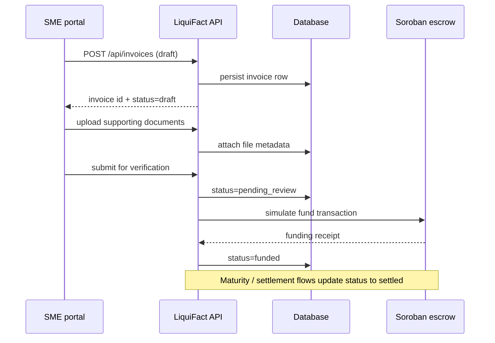

# Invoice lifecycle and escrow funding

```mermaid
sequenceDiagram
  participant SME as SME portal
  participant API as LiquiFact API
  participant DB as Database
  participant Escrow as Soroban escrow

  SME->>API: POST /api/invoices (draft)
  API->>DB: persist invoice row
  API-->>SME: invoice id + status=draft

  SME->>API: upload supporting documents
  API->>DB: attach file metadata

  SME->>API: submit for verification
  API->>DB: status=pending_review

  API->>Escrow: simulate fund transaction
  Escrow-->>API: funding receipt
  API->>DB: status=funded

  Note over API,Escrow: Maturity / settlement flows update status to settled
```

Capital-moving states (`funded`, `settled`) require KYC gating — see
`docs/invoice-lifecycle-api.md` for the full state machine.
