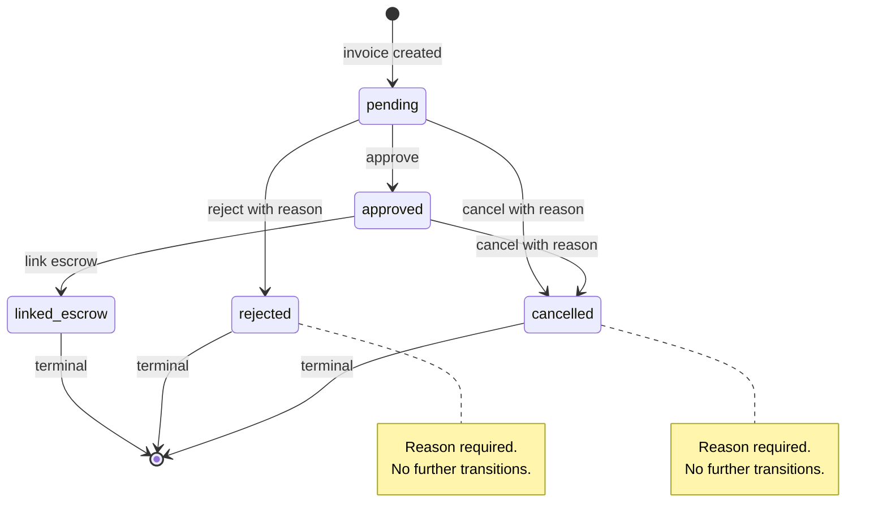
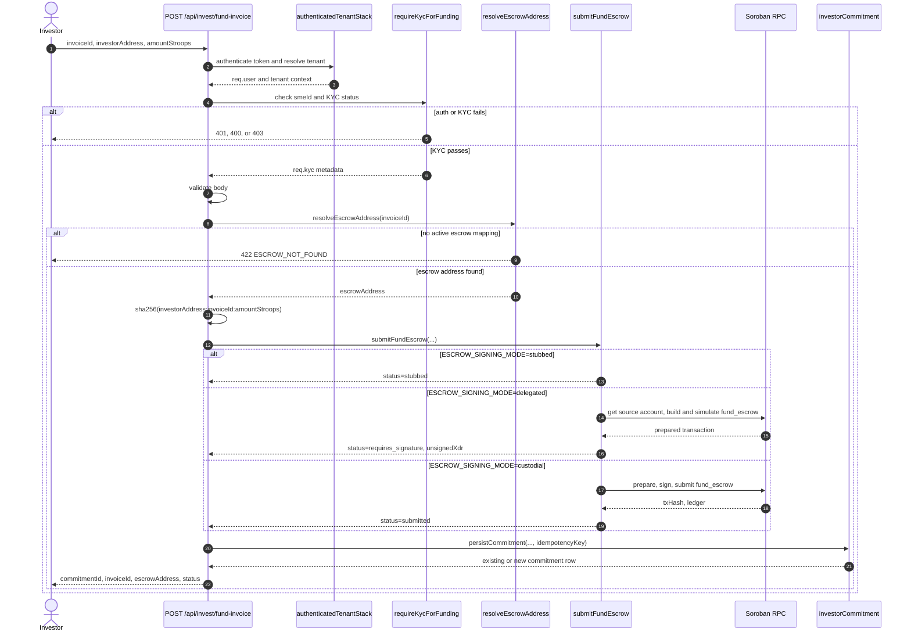

# Invoice lifecycle and escrow funding flow

This guide ties the invoice state machine to the `POST /api/invest/fund-invoice` escrow funding path. It is source-aligned with:

- [`src/services/invoiceStateMachine.js`](../src/services/invoiceStateMachine.js)
- [`src/routes/invest.js`](../src/routes/invest.js)
- [`src/middleware/kycGating.js`](../src/middleware/kycGating.js)
- [`src/services/escrowSubmit.js`](../src/services/escrowSubmit.js)
- [`src/services/investorCommitment.js`](../src/services/investorCommitment.js)

## State model

| State | Meaning | Terminal |
| --- | --- | --- |
| `pending` | Initial invoice state after creation. | No |
| `approved` | Invoice has passed review and can be linked to escrow. | No |
| `linked_escrow` | Invoice is linked to an escrow contract. | Yes |
| `rejected` | Invoice was rejected during verification. | Yes |
| `cancelled` | Invoice was cancelled before terminal settlement. | Yes |

## Allowed transitions

| From | To | Reason required | Source rule |
| --- | --- | --- | --- |
| `pending` | `approved` | No | `VALID_TRANSITIONS.pending` |
| `pending` | `rejected` | Yes | `VALID_TRANSITIONS.pending`, `TERMINAL_REASON_REQUIRED_STATES` |
| `pending` | `cancelled` | Yes | `VALID_TRANSITIONS.pending`, `TERMINAL_REASON_REQUIRED_STATES` |
| `approved` | `linked_escrow` | No | `VALID_TRANSITIONS.approved` |
| `approved` | `cancelled` | Yes | `VALID_TRANSITIONS.approved`, `TERMINAL_REASON_REQUIRED_STATES` |
| `linked_escrow` | any | Not allowed | terminal state |
| `rejected` | any | Not allowed | terminal state |
| `cancelled` | any | Not allowed | terminal state |

Reasons are normalized by `normalizeTransitionReason()`: control characters are replaced, whitespace is trimmed, and blank reasons become `null`. Reasons for `rejected` and `cancelled` are required and capped at `1024` characters.

## State diagram

## KYC-gated funding entrypoint

`POST /api/invest/fund-invoice` is the capital-moving funding route. It is mounted in [`src/routes/invest.js`](../src/routes/invest.js) behind `authenticatedTenantStack` and `requireKycForFunding`.

The KYC gate enforces:

- `req.user.sub` must exist.
- `smeId` must come from the authenticated JWT principal (`req.user.smeId`), never from request body or route params.
- KYC status must be `verified` or `exempted`.

If the gate fails, the request stops before body validation, escrow address lookup, Soroban transaction preparation, or commitment persistence.

## Funding request sequence

## Funding flow by stage

| Stage | Source | Success output | Failure output |
| --- | --- | --- | --- |
| Auth and tenant context | `authenticatedTenantStack` | `req.user`, tenant context | Auth middleware error |
| KYC gate | `requireKycForFunding` | `req.kyc` metadata | `401 UNAUTHORIZED`, `400 MISSING_SME_ID`, or `403 KYC_GATE_FAILED` |
| Body validation | `validateFundInvoiceBody` | Valid `invoiceId`, `investorAddress`, `amountStroops` | `400 VALIDATION_ERROR` |
| Escrow address lookup | `resolveEscrowAddress` | `escrowAddress` | `422 ESCROW_NOT_FOUND` |
| Soroban preparation/submission | `submitFundEscrow` | `stubbed`, `requires_signature`, or `submitted` | `502 ESCROW_SUBMIT_FAILED` |
| Commitment persistence | `persistCommitment` | Existing or new commitment row | DB-layer error handled by route error middleware |

## Response fields

The route returns only client-relevant fields:

- `commitmentId`
- `invoiceId`
- `escrowAddress`
- `status`
- `unsignedXdr` when delegated signing is required
- `txHash` and `ledger` when a custodial submission succeeds

The deterministic idempotency key is never returned.

## Operational notes

- `ESCROW_SIGNING_MODE=delegated` is the preferred non-custodial flow: the API returns unsigned XDR and the investor signs client-side.
- `ESCROW_SIGNING_MODE=custodial` requires server-held signing material and must keep `ESCROW_PLATFORM_SECRET` in deployment secrets only.
- `ESCROW_SIGNING_MODE=stubbed` is useful for local development and tests but does not execute an on-chain payment.
- `ESCROW_ADDR_BY_INVOICE` must map the invoice to an active escrow contract before funding can proceed.
