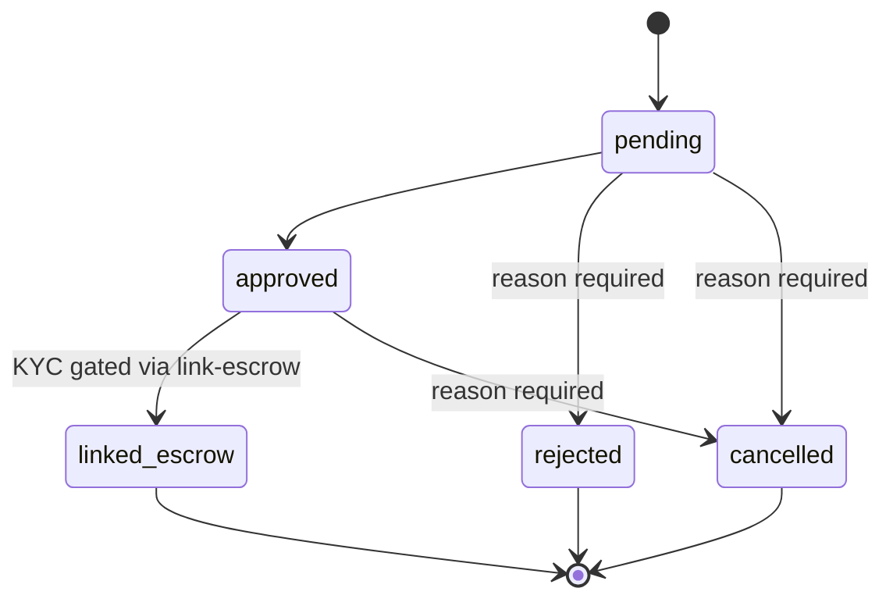
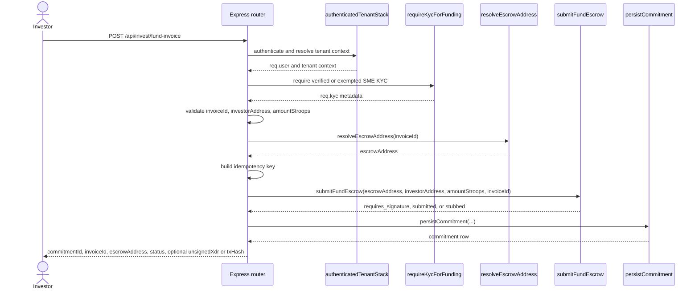

# Invoice Lifecycle and Funding Flow

This document ties together the invoice state machine, escrow-linking rules, and
funding flow used by the LiquiFact backend. It complements
[`docs/invoice-lifecycle-api.md`](./invoice-lifecycle-api.md), which focuses on
endpoint request and response examples.

Source references:

- [`src/services/invoiceStateMachine.js`](../src/services/invoiceStateMachine.js)
- [`src/routes/invoiceStateRoutes.js`](../src/routes/invoiceStateRoutes.js)
- [`src/routes/invest.js`](../src/routes/invest.js)
- [`src/middleware/kycGating.js`](../src/middleware/kycGating.js)
- [`src/services/escrowSubmit.js`](../src/services/escrowSubmit.js)
- [`src/services/investorCommitment.js`](../src/services/investorCommitment.js)

## State Model

`INVOICE_STATES` defines five canonical invoice states:

| State | Meaning | Terminal |
| --- | --- | --- |
| `pending` | Initial invoice state before review. | No |
| `approved` | Invoice has passed verification and can be linked to escrow. | No |
| `linked_escrow` | Invoice is linked to an escrow contract. | Yes |
| `rejected` | Invoice was rejected during review. | Yes |
| `cancelled` | Invoice was cancelled. | Yes |

## Transition Rules

`VALID_TRANSITIONS` is the authoritative transition table:

| From | Allowed targets | Reason required | KYC gated |
| --- | --- | --- | --- |
| `pending` | `approved`, `rejected`, `cancelled` | `rejected`, `cancelled` | No |
| `approved` | `linked_escrow`, `cancelled` | `cancelled` | `linked_escrow` when using `POST /api/invoices/:id/link-escrow` |
| `linked_escrow` | none | n/a | n/a |
| `rejected` | none | n/a | n/a |
| `cancelled` | none | n/a | n/a |

Additional validation enforced by `validateTransition`:

- `invoiceId`, `currentState`, `targetState`, and `actor` are required.
- Source and target states must be known `INVOICE_STATES` values.
- A request cannot transition to the current state again.
- Terminal source states cannot transition further.
- Reasons for `rejected` and `cancelled` are sanitized and limited to 1024
  characters.
- Every executed transition writes an audit log through
  `executeTransition`.

`canLinkToEscrow` adds a business rule on top of the state table: an invoice can
only be linked to escrow when its current `status` is exactly `approved`.

## KYC and Tenant Boundaries

Capital-movement paths use `requireKycForFunding` from
[`src/middleware/kycGating.js`](../src/middleware/kycGating.js).

| Route or transition | Gate | Notes |
| --- | --- | --- |
| `POST /api/invest/fund-invoice` | Always KYC gated | `src/routes/invest.js` applies `authenticatedTenantStack` to the router and `requireKycForFunding` to the funding route. |
| `POST /api/invoices/:id/link-escrow` | Always KYC gated | `src/routes/invoiceStateRoutes.js` applies `requireKycForFunding` before executing the `approved -> linked_escrow` transition. |
| `POST /api/invoices/:id/transition` | Conditionally KYC gated | `conditionalKycGate` only runs KYC for `funded` or `settled` targets. Those targets are not part of the current `INVOICE_STATES` / `VALID_TRANSITIONS` table, so they cannot currently complete as invoice lifecycle transitions. |

The KYC middleware resolves `smeId` only from the authenticated JWT principal
(`req.user.smeId`). It does not trust `req.body.smeId` or `req.params.smeId`,
which prevents callers from borrowing another SME's verified status.

## Funding Flow

`POST /api/invest/fund-invoice` funds an invoice through the escrow contract path
without changing the invoice state machine directly. It produces an investor
commitment record and returns the escrow submission status.

### Funding Request Steps

1. `authenticatedTenantStack` runs for all `/api/invest` routes.
2. `requireKycForFunding` blocks unauthenticated callers, JWTs without `smeId`,
   and SMEs whose KYC status is not `verified` or `exempted`.
3. `validateFundInvoiceBody` validates:
   - `invoiceId`: 3 to 64 characters, alphanumeric plus hyphen or underscore.
   - `investorAddress`: Stellar public key or contract address starting with
     `G` or `C`.
   - `amountStroops`: positive integer.
4. `resolveEscrowAddress(invoiceId)` resolves the invoice to a configured escrow
   contract address. Missing mappings return `ESCROW_NOT_FOUND`.
5. The route builds a deterministic SHA-256 idempotency key from
   `investorAddress`, `invoiceId`, and `amountStroops`.
6. `submitFundEscrow` prepares the Soroban `fund_escrow` call:
   - `stubbed` returns a deterministic stub result.
   - `delegated` returns an unsigned XDR for client-side signing.
   - `custodial` signs and submits with the platform secret.
7. `persistCommitment` stores the commitment in `investor_commitments` or
   returns the existing row when the idempotency key has already been processed.
8. The API returns `commitmentId`, `invoiceId`, `escrowAddress`, and `status`.
   It only includes `unsignedXdr`, `txHash`, or `ledger` when those fields are
   present for the selected signing mode.

## Failure and Edge Cases

| Case | Result |
| --- | --- |
| Invalid request body | `400 VALIDATION_ERROR` from `src/routes/invest.js`. |
| Missing escrow mapping | `422 ESCROW_NOT_FOUND`. |
| Escrow submit preparation fails | `502 ESCROW_SUBMIT_FAILED`; RPC internals are not returned to the client. |
| Duplicate funding request | `persistCommitment` returns the existing row for the same idempotency key. |
| Transition from a terminal state | `TERMINAL_STATE` from `validateTransition`. |
| Missing reason for `rejected` or `cancelled` | `MISSING_TRANSITION_REASON`. |
| Direct `pending -> linked_escrow` transition | `INVALID_TRANSITION`; invoice must move through `approved`. |

## Relationship Between State and Funding

The state machine and the funding endpoint are related but separate:

- `approved -> linked_escrow` records that an invoice is linked to escrow and is
  KYC-gated through `POST /api/invoices/:id/link-escrow`.
- `POST /api/invest/fund-invoice` performs the investor funding path for an
  already configured escrow mapping and persists an investor commitment.
- The funding endpoint does not itself call `executeTransition`; reconciliation
  and on-chain event projection are documented in
  [`docs/escrow-integration-overview.md`](./escrow-integration-overview.md).
