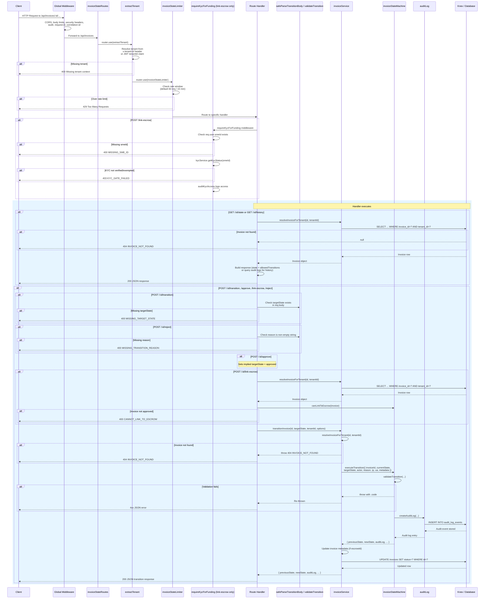

# Invoice-State Request Lifecycle

> **Audience:** New contributors who need an end-to-end view of how an
> invoice-state request flows through the application, from HTTP request to
> database persistence and back.

## Diagram



## Request Lifecycle Step by Step

### 1. Global Middleware (`src/app.js`)

Every request entered through the LiquiFact Express application passes through
a global middleware stack **before** any feature router is reached. This stack
is defined in `src/app.js:120-170` (the `createApp` function) and runs in this
order:

| Step | Middleware | Purpose |
|------|-----------|---------|
| 1 | CORS (`createCorsOptions`) | Environment-driven origin allowlist (`src/config/cors.js`) |
| 2 | JSON body limit | Global 100 KB payload guardrail (`src/middleware/bodySizeLimits.js`) |
| 3 | URL-encoded body limit | Form payloads at 50 KB |
| 4 | Security headers (`createSecurityMiddleware`) | Helmet-style hardening (`src/middleware/security.js`) |
| 5 | Audit middleware | Structured request audit trail (`src/middleware/audit.js`) |
| 6 | Request ID | Resolves canonical request identifier (`src/middleware/requestId.js`) |
| 7 | Correlation ID | Echoes identifier in response headers (`src/middleware/correlationId.js`) |

If the request body exceeds the JSON limit (100 KB), the request is rejected
with `413 Payload Too Large` **before** it ever reaches the invoice-state
router.

The full middleware order is documented in
[`docs/request-lifecycle-middleware-order.md`](request-lifecycle-middleware-order.md).

---

### 2. Router Mounting (`src/app.js:384`)

After global middleware, Express resolves the URL against mounted routers. The
invoice-state router is mounted at line 384 of `src/app.js`:

```js
mountFeatureRouter(app, '/api/invoices', invoiceStateRoutes);
```

Because `mountFeatureRouter` uses `app.use(basePath, router)`, a request to
`/api/invoices/inv-001/state` reaches the `invoiceStateRoutes` router where
Express parses `req.params.id` as `inv-001` and matches the `state` route.

**Mount order:** The invoice-state router is the **third** feature router
mounted overall (after SME routes and invoice file routes). Two routers share
the `/api/invoices` base path — the file-upload router and the state-router
are separate instances.

---

### 3. Router-Level Middleware (`src/routes/invoiceStateRoutes.js`)

All six invoice-state endpoints share two pieces of middleware that run on
**every** request to the router:

#### 3a. Tenant Extraction (`src/middleware/tenant.js:54`)

```js
router.use(extractTenant);  // line 31 of invoiceStateRoutes.js
```

`extractTenant` resolves the tenant identifier and attaches it to `req.tenantId`:

1. **Highest priority:** The `x-tenant-id` request header is read, trimmed,
   and validated (max 128 chars). If valid, it is set as `req.tenantId`.
2. **Fallback:** If the header is absent, the `tenantId` claim from the
   authenticated JWT (`req.user.tenantId`) is used.

If **neither** source yields a valid non-empty string, the middleware responds
with `400 Bad Request` and an RFC 7807-style error body:

```json
{
  "error": "Missing tenant context.",
  "message": "A valid tenant identifier must be supplied via the x-tenant-id header or an authenticated JWT claim."
}
```

The tenant ID is also propagated to the request-scoped logging context via
`setContext({ tenantId })` in `src/requestContext.js`.

**Cross-tenant isolation:** All downstream DB queries filter by `tenant_id`,
so one tenant can never read or mutate another tenant's invoices. Invoice
lookups that cross tenants return `null`, which the handlers convert to
`404 INVOICE_NOT_FOUND` — indistinguishable from "invoice does not exist".

#### 3b. Rate Limiting (`src/middleware/rateLimit.js:341`)

```js
router.use(invoiceStateLimiter);  // line 35 of invoiceStateRoutes.js
```

`invoiceStateLimiter` uses `express-rate-limit` with configurable window and
maximum:

| Env variable | Default | Description |
|-------------|---------|-------------|
| `RATE_LIMIT_INVOICE_STATE_WINDOW_MS` | 900 000 (15 min) | Rate-limit window in milliseconds |
| `RATE_LIMIT_INVOICE_STATE_MAX` | 60 | Max requests per window per client |

The `keyGenerator` (line 349-353) keys on the API key (`x-api-key` header) or
the client IP address (`req.ip`). When the limit is exceeded, the middleware
sets `Retry-After` via `standardHeaders` and responds with `429 Too Many
Requests`.

---

### 4. Route-Specific Middleware (KYC Gating, `src/routes/invoiceStateRoutes.js:209`)

Only one invoice-state endpoint adds extra middleware:

```js
router.post('/:id/link-escrow', requireKycForFunding, auditKycAccess, async (req, res, next) => {
```

#### `requireKycForFunding` (`src/middleware/kycGating.js:35`)

1. **Checks `smeId` claim:** Reads `req.user.smeId`. If absent, responds
   with `400 MISSING_SME_ID`.
2. **Gets KYC status:** Calls `kycService.getKycStatus(smeId)` to fetch the
   SME's current KYC state.
3. **Validates KYC status:** Calls `kycService.canFundWithKycStatus(status)`.
   Only `verified` or `exempted` statuses are permitted. If the status is
   insufficient (e.g. `pending`), responds with `403 KYC_GATE_FAILED` and
   the current status in the message.

#### `auditKycAccess` (`src/middleware/kycGating.js:74`)

Logs a structured `'KYC-gated endpoint accessed'` message with `userId`,
`smeId`, `endpoint`, and `method` for the audit trail.

**No authentication middleware is applied at the router level** — invoice-state
routes rely on upstream authentication (e.g. `authenticateToken` from the
caller's middleware chain) or on the `x-tenant-id` header for service-to-service
flows.

---

### 5. Route Handlers (`src/routes/invoiceStateRoutes.js`)

The six handlers map to six distinct URL patterns:

| Method | Path | Handler Function | Lines |
|--------|------|-----------------|-------|
| GET | `/:id/state` | `router.get('/:id/state', ...)` | 81-106 |
| POST | `/:id/transition` | `router.post('/:id/transition', ...)` | 114-158 |
| POST | `/:id/approve` | `router.post('/:id/approve', ...)` | 164-202 |
| POST | `/:id/link-escrow` | `router.post('/:id/link-escrow', ...)` | 209-263 |
| POST | `/:id/reject` | `router.post('/:id/reject', ...)` | 269-314 |
| GET | `/:id/history` | `router.get('/:id/history', ...)` | 320-344 |

#### GET /:id/state — Read current state

**Pure read** — no writes, no body validation.

1. Calls `invoiceService.resolveInvoiceForTenant(id, req.tenantId)`.
2. If `null`, returns `404 INVOICE_NOT_FOUND`.
3. Reads `invoice.status` as the current state.
4. Calls `getAllowedTransitions(currentState)` from the state machine to
   enumerate valid next states.
5. Builds response: `{ invoiceId, currentState, allowedTransitions, isTerminal }`.

#### GET /:id/history — Read transition history

**Pure read** — no writes.

1. Same tenant-scoped invoice resolution as `GET /state`.
2. Calls `getTransitionHistory(id, getAuditLogs)` which queries the
   `audit_log_events` table filtered by `resourceId` and `action =
   'STATE_TRANSITION'`.
3. Returns transitions ordered most-recent-first.

#### POST /:id/transition — Generic state transition

**Write endpoint** — modifies invoice status and creates an audit log.

1. **Route-level validation:** Checks that `targetState` exists in `req.body`.
   If absent, returns `400 MISSING_TARGET_STATE`.
2. **Actor resolution:** `getActorFromRequest(req)` resolves the acting user
   from `req.user.id`, `req.user.sub`, or falls back to `req.ip`.
3. **Service call:** Delegates to `invoiceService.transitionInvoice(id,
   targetState, req.tenantId, options)`.
4. **Error handling:** If an error with a `.code` property is thrown (e.g.
   `INVALID_TRANSITION`), `sendTransitionError` maps it to a 4xx response.
5. **Success:** Returns `200` with `{ invoiceId, previousState, currentState,
   transitionedAt, transitionedBy, reason, auditLogId }`.

#### POST /:id/approve — Convenience approve

1. Implicitly sets `targetState = INVOICE_STATES.APPROVED`.
2. Default reason: `'Invoice approved'` if not provided.
3. Delegates to `transitionInvoice` with the same pipeline.

#### POST /:id/link-escrow — Escrow linking (KYC-gated)

1. **Pre-handler:** `requireKycForFunding` and `auditKycAccess` middleware
   run first (see Step 4 above).
2. **Invoice resolution + business rules:** Resolves the invoice, then calls
   `canLinkToEscrow(invoice)` to verify the invoice is in `approved` state.
3. If `canLinkToEscrow` returns `{ canLink: false }`, returns `400
   CANNOT_LINK_TO_ESCROW`.
4. Delegates to `transitionInvoice` with `targetState = LINKED_ESCROW`,
   passing `escrowId` which is persisted into `invoice.metadata`.

#### POST /:id/reject — Convenience reject

1. **Route-level validation:** Requires a non-empty string `reason`. If
   absent, empty, or whitespace-only, returns `400 MISSING_TRANSITION_REASON`.
2. Delegates to `transitionInvoice` with `targetState = INVOICE_STATES.REJECTED`.

---

### 6. Body Schema Validation (`src/schemas/invoiceState.js`)

The `safeParseTransitionBody` function validates the request body for
transition writes. It performs four sequential checks, accumulating all errors
before returning:

#### 6a. Top-level shape

- `undefined` → `fieldErrors._root = 'MISSING_BODY'`
- `null`, non-object, or array → `fieldErrors._root = 'INVALID_BODY_TYPE'`

#### 6b. Unknown top-level keys

Every key in the input must belong to `ALLOWED_TOP_LEVEL_KEYS`:

```js
new Set(['targetState', 'reason', 'actor', 'currentState', 'metadata'])
```

This catches prototype-pollution vectors (`__proto__`, `constructor`)
deterministically, independent of Zod internals. Unknown keys produce
`fieldErrors.<key> = 'UNRECOGNIZED_FIELD'`.

#### 6c. Zod field validation

The Zod schema (`transitionBodySchema`) validates:

| Field | Type | Constraints |
|-------|------|-------------|
| `targetState` | Enum | Must be one of `BOUNDED_TARGET_STATES` (all 15 statuses from `ALL_INVOICE_STATUSES`) |
| `reason` | String (optional) | Max 1 024 chars, trimmed |
| `actor` | String (optional) | Max 100 chars, trimmed |
| `currentState` | Enum (optional) | Same enum as `targetState` |
| `metadata` | Unknown (optional) | Pass-through; validated recursively in step 4 |

Zod issues are remapped to machine-readable uppercase codes via
`remapIssueCode()`. For example:
- Missing/invalid `targetState` → `MISSING_TARGET_STATE` or `INVALID_TARGET_STATE`
- Oversized `reason` → `TRANSITION_REASON_TOO_LONG`
- Wrong type for `reason` → `INVALID_REASON_TYPE`
- `unrecognized_keys` from `.strict()` → `UNRECOGNIZED_FIELD` (skipped in
  favour of the explicit check in step 2)

#### 6d. Metadata recursive shape check

The `validateMetadataShape` function recursively validates:

| Constraint | Value |
|-----------|-------|
| Max depth | 3 levels |
| Max keys per object | 50 |
| Max key length | 64 chars |
| Max value length (string) | 64 chars |
| Max array length | 100 elements |

Violations produce codes like `METADATA_DEPTH_EXCEEDED`,
`METADATA_TOO_MANY_KEYS`, `METADATA_KEY_TOO_LONG`, `METADATA_VALUE_TOO_LONG`,
`METADATA_ARRAY_TOO_LONG`, or `INVALID_METADATA_TYPE`.

**Note:** The schema validator (`safeParseTransitionBody`) is exported and
tested independently (`tests/invoice.stateValidation.test.js`) but is **not
currently called by the route handlers** — the handlers perform their own
lightweight validation inline (e.g. checking `!targetState`). The schema
exists as the authoritative specification of the expected body shape and is
available for future integration into the request pipeline.

---

### 7. Service Layer — `invoiceService.transitionInvoice` (`src/services/invoiceService.js:534`)

This is the **orchestrator** that ties together invoice resolution, state
machine execution, and persistence:

```js
async function transitionInvoice(invoiceId, targetState, tenantId, options = {}) {
```

#### Step 7a: Tenant-scoped invoice resolution

```js
const invoice = await module.exports.resolveInvoiceForTenant(invoiceId, tenantId);
if (!invoice) {
  const err = new Error('Invoice not found');
  err.code = 'INVOICE_NOT_FOUND';
  err.statusCode = 404;
  throw err;
}
```

Calls `getInvoiceById(invoiceId, tenantId)` which runs:

```sql
SELECT * FROM invoices
WHERE invoice_id = ? AND tenant_id = ? AND deleted_at IS NULL
LIMIT 1
```

If the row does not exist, is soft-deleted, or belongs to a different tenant,
`null` is returned and an error with `INVOICE_NOT_FOUND` code is thrown.

#### Step 7b: State machine execution

```js
const result = await executeTransition({
  invoiceId,
  currentState: invoice.status,
  targetState,
  actor,
  reason,
  ipAddress,
  userAgent,
  metadata,
});
```

The invoice's **actual** current `status` (from the database) is passed as
`currentState` — the client never supplies the current state. This guarantees
that stale or forged `currentState` values from the client are ignored.

#### Step 7c: Persistence

```js
const updates = { status: result.newState };

if (escrowId !== undefined) {
  const meta = parseInvoiceMetadata(invoice.metadata);
  if (escrowId) {
    meta.escrowId = escrowId;
  }
  updates.metadata = JSON.stringify(meta);
}

await module.exports.updateInvoice(invoiceId, updates, tenantId);
```

The new `status` from the state machine result is written back to the
database. For `link-escrow`, the `escrowId` is also merged into the
`metadata` JSON column.

---

### 8. State Machine — `invoiceStateMachine.executeTransition` (`src/services/invoiceStateMachine.js:282`)

#### Step 8a: Validation (`validateTransition`, lines 185-265)

A pure function that checks every precondition and returns
`{ isValid: true }` or `{ isValid: false, error, code, allowedTransitions }`.

Validation order (short-circuits on first failure):

| Order | Check | Error Code |
|-------|-------|------------|
| 1 | `invoiceId` is present | `MISSING_INVOICE_ID` |
| 2 | `currentState` is present | `MISSING_CURRENT_STATE` |
| 3 | `targetState` is present | `MISSING_TARGET_STATE` |
| 4 | `actor` is present | `MISSING_ACTOR` |
| 5 | `currentState` is in `ALL_INVOICE_STATUSES` | `INVALID_CURRENT_STATE` |
| 6 | `targetState` is in `ALL_INVOICE_STATUSES` | `INVALID_TARGET_STATE` |
| 7 | `currentState !== targetState` | `ALREADY_IN_TARGET_STATE` |
| 8 | `currentState` is not terminal | `TERMINAL_STATE` |
| 9 | If target is `rejected`/`cancelled`: reason exists after normalization | `MISSING_TRANSITION_REASON` |
| 10 | If reason exists: length ≤ 1 024 | `TRANSITION_REASON_TOO_LONG` |
| 11 | `(currentState → targetState)` is in `VALID_TRANSITIONS` | `INVALID_TRANSITION` (includes `allowedTransitions` in details) |

#### The valid transition matrix (`VALID_TRANSITIONS`, line 86)

```js
const VALID_TRANSITIONS = Object.freeze({
  [PENDING]:       [APPROVED, REJECTED, CANCELLED],
  [APPROVED]:      [LINKED_ESCROW, CANCELLED],
  [LINKED_ESCROW]: [],
  [REJECTED]:      [],
  [CANCELLED]:     [],
});
```

#### Step 8b: Reason normalization (`normalizeTransitionReason`, lines 115-123)

```js
function normalizeTransitionReason(reason) {
  if (reason === null || reason === undefined) return null;
  const value = typeof reason === 'string' ? reason : String(reason);
  const sanitized = value.replace(/[\u0000-\u001F\u007F]+/g, ' ').trim();
  return sanitized.length === 0 ? null : sanitized;
}
```

Control characters (U+0000–U+001F, U+007F) are replaced with spaces, then
whitespace-trimmed. A result that is empty or whitespace-only is treated as
`null` — this triggers `MISSING_TRANSITION_REASON` when the target state
requires a reason.

#### Step 8c: Audit log creation (lines 303-319)

When validation passes, `executeTransition` creates an immutable audit log
entry via `createAuditLog`:

```js
const auditLog = await createAuditLog({
  actor,
  action: 'STATE_TRANSITION',
  resourceType: 'invoice',
  resourceId: invoiceId,
  before: { state: currentState },
  after: { state: targetState },
  statusCode: 200,
  ipAddress,
  userAgent,
  metadata: {
    ...metadata,
    ...(normalizedReason ? { reason: normalizedReason } : {}),
    transitionType: `${currentState}_to_${targetState}`,
    timestamp: new Date().toISOString(),
  },
});
```

This calls `auditLogStore.appendAuditEvent()` which performs the actual
`INSERT INTO audit_log_events` and returns a frozen entry object with the
generated `id` and `timestamp`.

The function then logs a structured `'Invoice state transition executed'`
message and returns:

```js
return {
  success: true,
  previousState: currentState,
  newState: targetState,
  auditLog,
  transitionedAt: auditLog.timestamp,
  transitionedBy: actor,
};
```

---

### 9. Audit Log Service (`src/services/auditLog.js`)

#### Audit log entry schema

| Field | Value |
|-------|-------|
| `eventType` | `'admin_action'` |
| `action` | `'STATE_TRANSITION'` |
| `actorType` | `'user'` |
| `actorId` | Actor identifier from `getActorFromRequest(req)` |
| `targetType` | `'invoice'` |
| `targetId` | The invoice ID |
| `statusCode` | `200` |
| `ipAddress` | From `req.ip` |
| `userAgent` | From `User-Agent` header |
| `metadata.before` | `{ state: "<previous state>" }` |
| `metadata.after` | `{ state: "<new state>" }` |
| `metadata.reason` | Normalized reason (if any) |
| `metadata.transitionType` | e.g. `'pending_to_approved'` |
| `metadata.timestamp` | ISO 8601 timestamp |

The `calculateChanges` helper (line 42) diffs the `before` and `after` objects
to only record changed fields. The `sanitizeSensitiveData` wrapper redacts
potential PII/secret values before storage.

---

### 10. Response Construction (`src/utils/responseHelper.js`)

All responses follow the standard envelope:

**Success:**
```json
{
  "data": { ... },
  "meta": { "timestamp": "...", "version": "0.1.0" },
  "error": null
}
```

**Error:**
```json
{
  "data": null,
  "meta": { "timestamp": "...", "version": "0.1.0" },
  "error": { "message": "...", "code": "ERROR_CODE", "details": null }
}
```

Route handlers wrap their data with `responseHelper.success()` and pass errors
through `responseHelper.error()`. Handlers caught unhandled exceptions via
`try/catch` and forward them to the Express `next(error)` chain, which the
global error handler converts to `500 INTERNAL_SERVER_ERROR`.

---

## Error Code Reference

| Code | HTTP | Source | When |
|------|------|--------|------|
| `MISSING_TARGET_STATE` | 400 | Route handler (`invoiceStateRoutes.js:119`) | `targetState` absent from request body |
| `MISSING_TRANSITION_REASON` | 400 | Route handler (reject, line 274) or `validateTransition` (line 240) | Reason required but absent |
| `TRANSITION_REASON_TOO_LONG` | 400 | `validateTransition` (line 248) | Reason exceeds 1 024 chars |
| `INVOICE_NOT_FOUND` | 404 | `transitionInvoice` (line 537) | Invoice not found or belongs to other tenant |
| `INVALID_TARGET_STATE` | 400 | `validateTransition` (line 213) | `targetState` not in `ALL_INVOICE_STATUSES` |
| `INVALID_CURRENT_STATE` | 400 | `validateTransition` (line 206) | Invoice has unrecognised status (data integrity) |
| `INVALID_TRANSITION` | 400 | `validateTransition` (line 258) | `currentState → targetState` not allowed |
| `ALREADY_IN_TARGET_STATE` | 400 | `validateTransition` (line 222) | `currentState` equals `targetState` |
| `TERMINAL_STATE` | 400 | `validateTransition` (line 231) | Invoice is in a terminal state |
| `MISSING_ACTOR` | 400 | `validateTransition` (line 199) | `actor` absent |
| `CANNOT_LINK_TO_ESCROW` | 400 | Route handler (`invoiceStateRoutes.js:222`) | Invoice not in `approved` state for link-escrow |
| `MISSING_SME_ID` | 400 | `requireKycForFunding` (`kycGating.js:39`) | JWT has no `smeId` claim |
| `KYC_GATE_FAILED` | 403 | `requireKycForFunding` (`kycGating.js:51`) | SME KYC status not `verified` or `exempted` |
| `INTERNAL_SERVER_ERROR` | 500 | Global error handler | Unexpected server-side error |

## Key Source Files

| File | Role |
|------|------|
| `src/app.js:384` | Router mount point |
| `src/routes/invoiceStateRoutes.js` | Six route handlers, router-level middleware |
| `src/schemas/invoiceState.js` | Zod body schema + recursive metadata validator |
| `src/services/invoiceStateMachine.js` | State machine constants, validation, execution |
| `src/services/invoiceService.js:534` | `transitionInvoice` orchestrator |
| `src/services/auditLog.js` | `createAuditLog` + `getAuditLogs` |
| `src/middleware/tenant.js:54` | `extractTenant` middleware |
| `src/middleware/rateLimit.js:341` | `invoiceStateLimiter` |
| `src/middleware/kycGating.js` | `requireKycForFunding` + `auditKycAccess` |
| `src/utils/responseHelper.js` | Standardised `success` / `error` envelopes |

## Related Test Files

| Test File | Coverage |
|-----------|----------|
| `tests/invoice.state.test.js` | Full transition matrix, audit emission, route integration (1 306 lines) |
| `tests/invoice.stateValidation.test.js` | Schema validation, edges cases, RFC 7807 envelope (840 lines) |
| `tests/invoiceStateRateLimit.test.js` | Rate limit configuration and regression |
| `tests/kyc.gating.test.js` | KYC middleware for capital-moving states |
| `tests/auditLog.persistence.test.js` | Audit log creation during transitions |
| `tests/webhooks.delivery.test.js` | Webhook triggering on state transitions |
| `tests/marketplace.test.js` | Status vocabulary alignment |
| `tests/mocks/setup.js:289` | No-op `invoiceStateLimiter` mock for other test suites |

---

*For the API reference (request/response shapes, endpoint details, state
descriptions), see [`docs/invoice-state.md`](invoice-state.md). For the
middleware ordering at the application level, see
[`docs/request-lifecycle-middleware-order.md`](request-lifecycle-middleware-order.md).*
