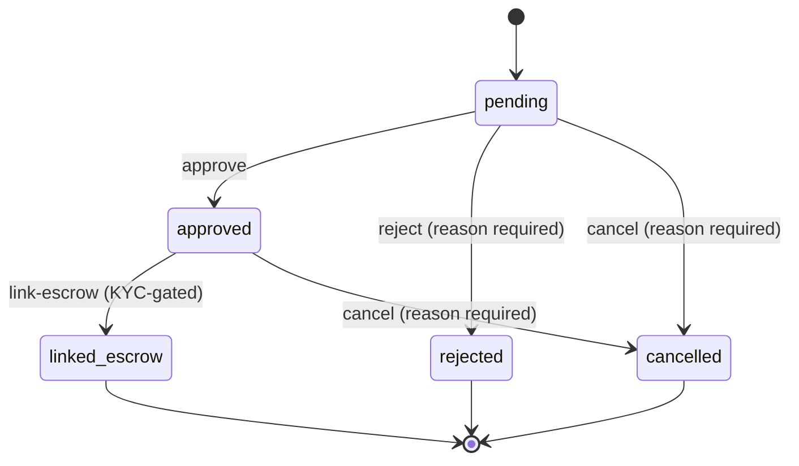

# Invoice State Machine

> **Source of truth:** `src/services/invoiceStateMachine.js`
> **Enforcement points:** `validateTransition()`, `executeTransition()`, `canLinkToEscrow()`, and `src/middleware/kycGating.js`

This document describes the lifecycle state machine that governs every invoice
in the LiquiFact platform. The state machine is the sole authority on whether
a transition is legal — no other code may write a status directly.

---

## Table of Contents

1. [States](#1-states)
2. [Transition Matrix](#2-transition-matrix)
3. [State Diagram](#3-state-diagram)
4. [Guards](#4-guards)
5. [Cross-References](#5-cross-references)

---

## 1. States

Five lifecycle states are defined in `INVOICE_STATES` (`src/services/invoiceStateMachine.js:15–21`):

| State | Value | Terminal | Capital-Moving | Reason Required to Enter |
|-------|-------|----------|----------------|--------------------------|
| Pending | `pending` | No | No | No |
| Approved | `approved` | No | No | No |
| Linked Escrow | `linked_escrow` | **Yes** | No | No |
| Rejected | `rejected` | **Yes** | No | **Yes** |
| Cancelled | `cancelled` | **Yes** | No | **Yes** |

**Terminal states** — listed in `TERMINAL_STATES` (`src/services/invoiceStateMachine.js:65–72`):

`linked_escrow`, `rejected`, `cancelled`, `completed`, `defaulted`, `settled`

Any invoice in a terminal state rejects all further transitions with error
code `TERMINAL_STATE`. The three lifecycle states above (`linked_escrow`,
`rejected`, `cancelled`) are the only terminal states reachable through the
core state-machine routes. The remaining three (`completed`, `defaulted`,
`settled`) are terminal states used by funding/settlement flows outside the
core routes.

**Capital-moving states** — defined in `CAPITAL_MOVING_STATES`
(`src/services/invoiceStateMachine.js:79`):

`funded`, `settled`

These trigger KYC gating when targeted. They are not part of the five-state
lifecycle managed by the invoice-state routes but are recognised by the broader
platform.

---

## 2. Transition Matrix

Source: `VALID_TRANSITIONS` (`src/services/invoiceStateMachine.js:86–92`).

| From ↓ \ To → | `pending` | `approved` | `linked_escrow` | `rejected` | `cancelled` |
|---------------|-----------|-----------|-----------------|------------|-------------|
| `pending`     | — | ✓ | — | ✓ | ✓ |
| `approved`    | — | — | ✓ | — | ✓ |
| `linked_escrow` | — | — | — | — | — |
| `rejected`    | — | — | — | — | — |
| `cancelled`   | — | — | — | — | — |

### Readable form

```
pending    → approved          (no reason required)
pending    → rejected          (reason required)
pending    → cancelled         (reason required)
approved   → linked_escrow     (no reason required; KYC-gated)
approved   → cancelled         (reason required)

linked_escrow → (terminal — no transitions out)
rejected      → (terminal — no transitions out)
cancelled     → (terminal — no transitions out)
```

### Rules

1. **No reversals.** Once an invoice moves forward it cannot go back
   (e.g. `approved → pending` is forbidden).
2. **No silent jumps.** `pending → linked_escrow` is not allowed; the invoice
   must pass through `approved` first.
3. **Terminal states are sinks.** Once in `linked_escrow`, `rejected`, or
   `cancelled`, the invoice accepts no further transitions.
4. **Reason is mandatory for terminal targets.** Transitioning to `rejected` or
   `cancelled` without a non-empty reason returns `MISSING_TRANSITION_REASON`.

---

## 3. State Diagram



`linked_escrow`, `rejected`, and `cancelled` are terminal — no outgoing
transitions exist.

---

## 4. Guards

Every transition passes through a series of guards enforced in code. Failure at
any guard short-circuits with a machine-readable error code.

### 4.1 `validateTransition` guards (in order)

Executed by `validateTransition()` (`src/services/invoiceStateMachine.js:185–265`).

| # | Guard | Error Code | Condition |
|---|-------|------------|-----------|
| 1 | `invoiceId` present | `MISSING_INVOICE_ID` | `invoiceId` is falsy |
| 2 | `currentState` present | `MISSING_CURRENT_STATE` | `currentState` is falsy |
| 3 | `targetState` present | `MISSING_TARGET_STATE` | `targetState` is falsy |
| 4 | `actor` present | `MISSING_ACTOR` | `actor` is falsy |
| 5 | `isValidState(currentState)` | `INVALID_CURRENT_STATE` | `currentState` not in `ALL_INVOICE_STATUSES` |
| 6 | `isValidState(targetState)` | `INVALID_TARGET_STATE` | `targetState` not in `ALL_INVOICE_STATUSES` |
| 7 | Same-state check | `ALREADY_IN_TARGET_STATE` | `currentState === targetState` |
| 8 | `!isTerminalState(currentState)` | `TERMINAL_STATE` | `currentState` is in `TERMINAL_STATES` |
| 9 | Reason required | `MISSING_TRANSITION_REASON` | `targetState` is `rejected` or `cancelled` and `reason` is absent/empty |
| 10 | Reason length | `TRANSITION_REASON_TOO_LONG` | `reason.length > 1024` |
| 11 | `isTransitionAllowed(from, to)` | `INVALID_TRANSITION` | `from→to` pair not in `VALID_TRANSITIONS` |

### 4.2 `canLinkToEscrow` guard

Executed by `canLinkToEscrow()` (`src/services/invoiceStateMachine.js:372–385`)
before the link-escrow transition.

| Guard | Error Code | Condition |
|-------|------------|-----------|
| Invoice exists | `CANNOT_LINK_TO_ESCROW` | Invoice is `null` |
| Status is `approved` | `CANNOT_LINK_TO_ESCROW` | `invoice.status !== 'approved'` |

### 4.3 KYC gating (middleware)

Enforced by `requireKycForFunding` (`src/middleware/kycGating.js`) on the
`POST /api/invoices/:id/link-escrow` route, before any handler code runs.

| Guard | Error Code | HTTP Status | Condition |
|-------|------------|-------------|-----------|
| `smeId` present on `req.user` | `MISSING_SME_ID` | 400 | `req.user.smeId` is falsy |
| KYC status passes | `KYC_GATE_FAILED` | 403 | `kycService.canFundWithKycStatus(status)` returns `false` |

### 4.4 Reason normalisation

`normalizeTransitionReason()` (`src/services/invoiceStateMachine.js:115–123`)
is applied before persistence:

1. Non-string values are coerced via `String()`.
2. Control characters (U+0000–U+001F, U+007F) are replaced with spaces.
3. Leading/trailing whitespace is trimmed.
4. An empty or whitespace-only result is treated as absent (`null`).

### 4.5 `executeTransition` audit

On success, `executeTransition()` (`src/services/invoiceStateMachine.js:282–337`)
creates an immutable `STATE_TRANSITION` audit log entry via `createAuditLog()`
containing: actor, before/after state, reason, IP, user agent, and any
additional metadata.

---

## 5. Cross-References

| Document | Path | Description |
|----------|------|-------------|
| Invoice State API Reference | `docs/invoice-state.md` | Full API reference: endpoints, request/response schemas, error codes |
| Invoice Lifecycle API | `docs/invoice-lifecycle-api.md` | High-level lifecycle description with API usage examples |
| Invoice Escrow Sequence | `docs/invoice-escrow-sequence.md` | Mermaid sequence diagram for escrow funding flow |
| State Machine Source | `src/services/invoiceStateMachine.js` | Authoritative implementation of states, transitions, and guards |
| State Routes | `src/routes/invoiceStateRoutes.js` | Express routes that expose the state machine over HTTP |
| Zod Schema | `src/schemas/invoiceState.js` | Inbound validation for transition request bodies |
| KYC Gating Middleware | `src/middleware/kycGating.js` | Middleware enforcing KYC on capital-moving transitions |

---

*Generated from `src/services/invoiceStateMachine.js` as of the current HEAD.
Verify accuracy by running `npm test tests/invoice.state.test.js`.*
