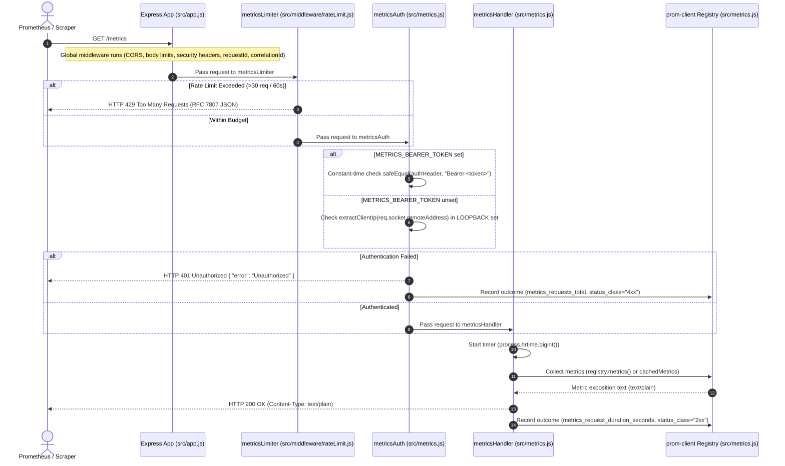

# Metrics Request Lifecycle

This document provides a comprehensive end-to-end guide to the `/metrics` request lifecycle within the LiquiFact backend application. It details how Prometheus scraping requests pass through validation, rate-limiting, security authentication, handler execution, and metric exposition.

---

## 1. Overview

The `/metrics` endpoint exposes operational metrics in the standard Prometheus exposition text format. It is designed to allow monitoring platforms (such as Prometheus or Grafana) to scrape application health, background worker queues, database reconciliation drift, API authentication performance, and contract wrapper status.

### Key Components

| Component | Source File | Description |
|-----------|-------------|-------------|
| **Route Registration** | [`src/app.js`](../src/app.js#L406) | Wires the route handler chain: `app.get('/metrics', metricsLimiter, metricsAuth, metricsHandler)` |
| **Rate Limiter Guard** | [`src/middleware/rateLimit.js`](../src/middleware/rateLimit.js#L370) | Prevents brute-force token guessing and denial-of-service (DoS) attacks on the metrics endpoint |
| **Auth Middleware** | [`src/metrics.js`](../src/metrics.js#L696) | Evaluates bearer tokens in constant time or checks socket loopback IP addresses |
| **Route Handler** | [`src/metrics.js`](../src/metrics.js#L735) | Renders metric exposition text from the registry and records request telemetry |
| **Registry & Store** | [`src/metrics.js`](../src/metrics.js#L290) | Central `prom-client.Registry` storing counters, gauges, histograms, and background job metrics |

---

## 2. End-to-End Request Lifecycle Diagram

### Sequence Diagram



---

## 3. Handler Chain Architecture

The handler chain is mounted explicitly in [`src/app.js`](../src/app.js#L406):

```javascript
app.get('/metrics', metricsLimiter, metricsAuth, metricsHandler);
```

### Stage 1: Validation & Rate Limiting (`metricsLimiter`)

* **Source File**: [`src/middleware/rateLimit.js`](../src/middleware/rateLimit.js)
* **Configuration Defaults**:
  * `METRICS_RATE_LIMIT_WINDOW_MS`: `60000` (1 minute)
  * `METRICS_RATE_LIMIT_MAX`: `30` requests per window
* **Key Generation**: `metricsRateLimitKeyGenerator` checks for `X-API-Key` (`apikey_<key>`) or falls back to direct remote IP address (`req.ip` / `req.socket.remoteAddress`).
* **Placement Rationale**: `metricsLimiter` is deliberately mounted **BEFORE** `metricsAuth`. This ensures that unauthenticated scrapers or brute-force token guessers consume rate-limit quota, preventing CPU exhaustion and timing probes on the authentication layer (Issue #744).
* **Store & Resilience**: Uses `resolveRateLimitStore('metrics')` to connect to Redis (`rate-limit-redis`). If Redis is unreachable, it fails open safely to an in-memory store.
* **429 Response**: Returns a structured RFC 7807 error payload:
  ```json
  {
    "type": "https://liquifact.com/probs/too-many-requests",
    "title": "Too Many Requests",
    "status": 429,
    "code": "RATE_LIMITED",
    "scope": "metrics",
    "error": "Too many requests.",
    "message": "Rate limit threshold breached for /metrics. Please try again later."
  }
  ```

---

### Stage 2: Authentication Guard (`metricsAuth`)

* **Source File**: [`src/metrics.js`](../src/metrics.js#L696)
* **Authentication Flow**:

```
                  +-----------------------------------+
                  | Is METRICS_BEARER_TOKEN set?      |
                  +-----------------+-----------------+
                                    |
                   +----------------+----------------+
                   |                                 |
                [ YES ]                           [ NO ]
                   |                                 |
                   v                                 v
   +-------------------------------+   +-------------------------------+
   | Extract Authorization header  |   | Extract direct TCP socket IP  |
   | Compare via safeEqual()       |   | req.socket.remoteAddress      |
   +---------------+---------------+   +---------------+---------------+
                   |                                 |
         +---------+---------+             +---------+---------+
         |                   |             |                   |
     [ Match ]         [ Mismatch ]    [ In LOOPBACK ]    [ Not LOOPBACK ]
         |                   |             |                   |
         v                   v             v                   v
      next()              401 JSON      next()              401 JSON
```

1. **Bearer Token Mode**:
   - If `METRICS_BEARER_TOKEN` is present in environment variables, the middleware inspects `Authorization` (or `authorization`).
   - Comparison uses `safeEqual(a, b)`—a constant-time string comparison function—to prevent timing side-channel attacks that could leak token characters.
2. **Loopback IP Mode**:
   - If `METRICS_BEARER_TOKEN` is **unset**, access is granted only to loopback origins.
   - Address determination strictly uses `req.socket.remoteAddress` via `extractClientIp(req)`.
   - The `X-Forwarded-For` header is **never** consulted, preventing remote clients from spoofing IP headers to bypass authentication.
   - Allowed loopback addresses: `127.0.0.1`, `::1`, `::ffff:127.0.0.1`.
3. **Uniform Error Handling**:
   - Rejections return a generic `{ error: 'Unauthorized' }` with HTTP status `401`.
   - No error details are returned to avoid revealing whether token configuration or IP origin was the reason for rejection.
   - Every rejection invokes `recordMetricsEndpointOutcome()` to record HTTP status `401` in telemetry metrics.

---

### Stage 3: Handler Execution (`metricsHandler`)

* **Source File**: [`src/metrics.js`](../src/metrics.js#L735)
* **Execution Steps**:
  1. **High-Resolution Timer Start**: Captures `process.hrtime.bigint()` to track wall-clock scrape duration.
  2. **Response Event Listeners**: Registers `done()` listeners on `res.on('finish')` and `res.on('close')`.
  3. **Header Settings**: Sets `Content-Type: text/plain` (matching `registry.contentType`).
  4. **Registry Rendering**:
     - **Production (`prom-client`)**: Calls `await registry.metrics()`, which serializes all registered counters, gauges, and histograms into Prometheus exposition format.
     - **Test Environment Shim**: Returns `cachedMetrics` generated by periodic background refresh routines.
  5. **Telemetry Recording (`recordMetricsEndpointOutcome`)**:
     - Updates `metrics_request_duration_seconds` (Histogram with `status_class` label `2xx`, `4xx`, `5xx`).
     - Increments `metrics_requests_total` (Counter with `status_class`).
     - Increments `metrics_request_errors_total` (Counter with bounded `cause` label: `none`, `auth_failure`, `internal_error`).

---

## 4. Metrics Registry Store & Persistence

The application metrics registry is instantiated in [`src/metrics.js`](../src/metrics.js#L290).

```javascript
const registry = new client.Registry();
```

### Registered Metric Types

| Category | Metric Name | Type | Purpose |
|----------|-------------|------|---------|
| **Endpoint Telemetry** | `metrics_request_duration_seconds` | Histogram | Scrape duration in seconds |
| **Endpoint Telemetry** | `metrics_requests_total` | Counter | Total scrapers handled |
| **Endpoint Telemetry** | `metrics_request_errors_total` | Counter | Errors by bounded cause (`auth_failure`, `internal_error`) |
| **Background Queues** | `liquifact_job_queue_depth` | Gauge | Number of pending jobs waiting in queues |
| **Background Queues** | `liquifact_job_retry_queue_size` | Gauge | Number of jobs waiting in retry queues |
| **Background Workers** | `liquifact_worker_inflight_count` | Gauge | Jobs currently being processed by workers |
| **Indexer State** | `escrow_indexer_events_processed_total` | Counter | Total escrow events indexed |
| **Indexer State** | `escrow_indexer_last_cursor_advance_timestamp_seconds` | Gauge | Timestamp of last cursor advancement |
| **Reconciliation** | `escrow_reconciliation_mismatches_total` | Counter | Mismatches between DB and Soroban on-chain state |
| **Reconciliation** | `escrow_reconciliation_drift_magnitude` | Gauge | Total absolute financial drift magnitude |
| **Rate Limiting** | `body_size_limit_rejections_total` | Counter | Payload size rejections (413) by type |
| **API Auth** | `api_key_auth_duration_seconds` | Histogram | Duration of API key authentication requests |

### Background Aggregation (`refreshMetrics`)

A background interval (`startMetricsRefresh()`, running every 5,000 ms) collects statistics from registered job queues (`registerJobQueue`) and workers (`registerWorker`):

1. Queries each registered queue for pending and retry queue lengths.
2. Queries registered workers for active in-flight processing counts.
3. Sets `queueDepthGauge`, `retryQueueSizeGauge`, and `workerInFlightGauge`.
4. Updates `cachedMetrics` string for test environments where `prom-client` native bindings are shimmed.

---

## 5. Security and Operational Guidelines

1. **Cardinality Guardrails**:
   - All metric labels are strictly mapped using bounded normalization helpers (e.g., `normalizeMetricsEndpointStatusClass`, `normalizeMetricsEndpointCause`, `normalizeSorobanRpcMethod`, `normalizeReminderReason`).
   - Dynamic user IDs, raw exception strings, and IP addresses are **never** used as Prometheus labels to prevent time-series cardinality explosions.
2. **Timing Side-Channel Protection**:
   - Authentication token comparison uses `safeEqual()` to ensure token validation time does not vary based on matching prefix length.
3. **IP Spoofing Defense**:
   - Direct TCP socket remote addresses (`req.socket.remoteAddress`) are inspected for loopback authorization. Header values such as `X-Forwarded-For` are ignored.
